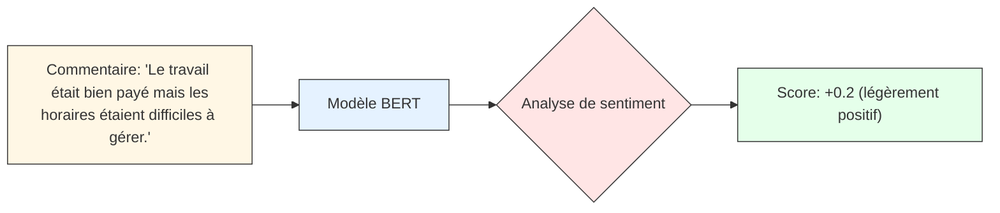
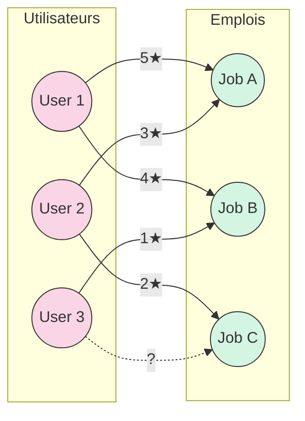
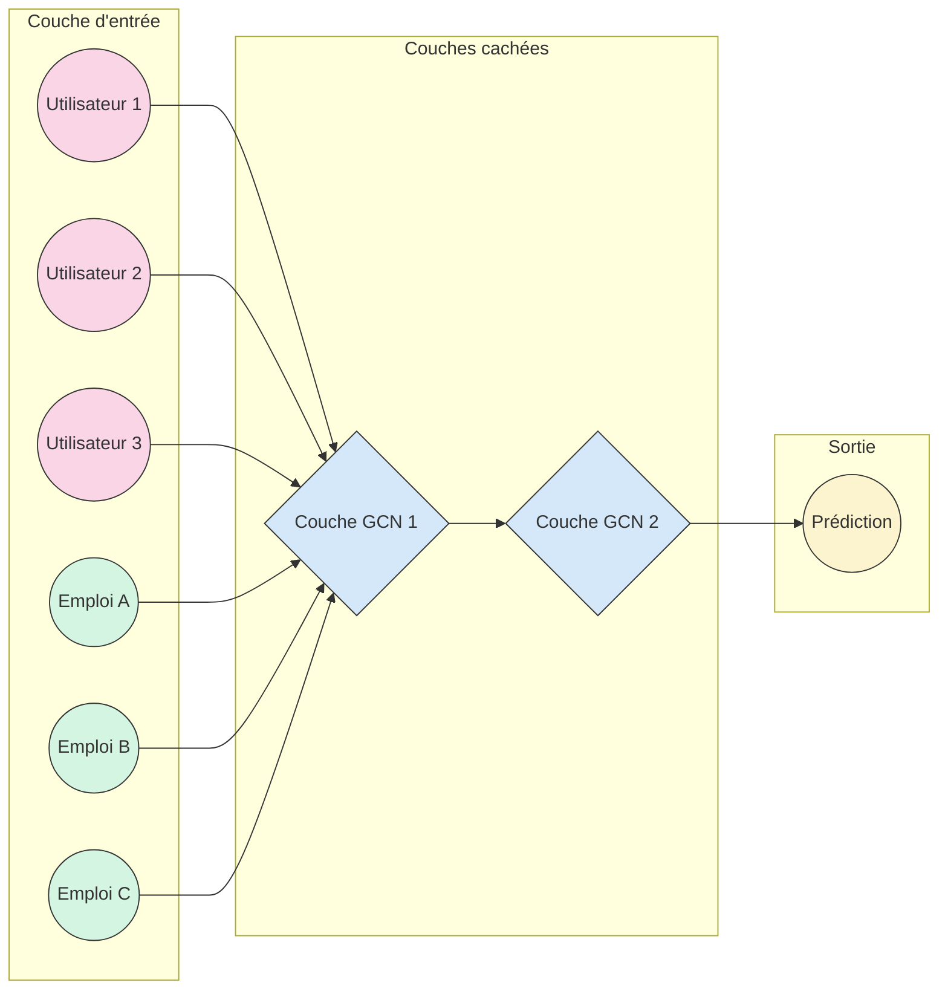

# Comprendre le Système de Recommandation JibJob

## Introduction

JibJob est une plateforme algérienne de petits emplois qui utilise un système de recommandation moderne pour connecter les utilisateurs aux emplois qui leur conviennent le mieux. Ce document explique comment fonctionne ce système de recommandation, en utilisant un langage simple même pour les personnes sans formation en apprentissage profond.

## Qu'est-ce qu'un système de recommandation ?

Un système de recommandation est comme un conseiller personnel qui vous suggère des choses que vous pourriez aimer, basé sur vos préférences passées et sur les préférences d'autres personnes similaires à vous.

**Dans la vie quotidienne :**
- Netflix vous recommande des films basés sur ce que vous avez regardé
- Amazon vous suggère des produits similaires à ceux que vous avez achetés
- Spotify crée des playlists personnalisées basées sur votre historique d'écoute

**Pour JibJob :**
Notre système recommande des emplois aux utilisateurs en fonction de leurs interactions passées et des caractéristiques des emplois et des utilisateurs.

## Vue d'ensemble du système

Le système de recommandation JibJob est construit en trois étapes principales :

1. **Simulation de données** : Création de données d'exemple pour tester le système
2. **Ingénierie des caractéristiques** : Transformation des données brutes en informations utiles
3. **Entraînement du modèle** : Apprentissage des patterns pour faire des recommandations

```mermaid
flowchart LR
    subgraph Simulation["1. Simulation de données"]
        users["Utilisateurs\n(ID, Profil)"]
        jobs["Emplois\n(ID, Description, Catégorie)"]
        interactions["Interactions\n(Notes, Commentaires)"]
        users --> interactions
        jobs --> interactions
    end
    subgraph Features["2. Ingénierie des caractéristiques"]
        sentiment["Analyse de sentiment\nBERT"]
        embeddings["Embeddings\nBERT"]
        enhanced["Caractéristiques améliorées\nNotes + Sentiment"]
        sentiment --> enhanced
        embeddings --> enhanced
    end
    subgraph GCN["3. Entraînement du modèle GCN"]
        graph["Construction du graphe"]
        training["Entraînement"]
        evaluation["Évaluation"]
        graph --> training
        training --> evaluation
    end
    interactions --> sentiment
    interactions --> embeddings
    enhanced --> graph
    evaluation --> API["API\nEndpoints de recommandation"]
    
    classDef simBox fill:#f5f5f5,stroke:#333,stroke-width:1px;
    classDef featBox fill:#e8f4f8,stroke:#333,stroke-width:1px;
    classDef gcnBox fill:#f9f2e7,stroke:#333,stroke-width:1px;
    classDef apiBox fill:#e5f9e5,stroke:#333,stroke-width:1px;
    class Simulation simBox;
    class Features featBox;
    class GCN gcnBox;
    class API apiBox;
```

Explorons chaque étape en détail.

## 1. Simulation de Données

Avant de construire un système de recommandation, nous avons besoin de données. Dans ce projet, nous utilisons des données simulées qui imitent le comportement réel des utilisateurs et des emplois.

### Quelles données sont générées ?

1. **Données utilisateurs** : Identifiants uniques et descriptions de profil
2. **Données d'emplois** : Identifiants, descriptions de mission et catégories
3. **Interactions** : Comment les utilisateurs ont interagi avec les emplois (notes, commentaires)

### Exemple simplifié

```
Utilisateur 1 → a noté l'emploi A avec 5 étoiles et a laissé un commentaire positif
Utilisateur 2 → a noté l'emploi B avec 2 étoiles et a laissé un commentaire négatif
```

### Exemples concrets de données

Voici à quoi ressemblent réellement nos données simulées :

#### Utilisateurs
| user_id  | description_profil_utilisateur_anglais |
|----------|----------------------------------------|
| user_123 | Experienced plumber with 5 years of work in residential and commercial settings. |
| user_456 | College student available for part-time work, experienced in customer service. |
| user_789 | Retired teacher looking for occasional gardening and tutoring opportunities. |

#### Emplois
| job_id  | description_mission_anglais | categorie_mission |
|---------|---------------------------|------------------|
| job_101 | Need help fixing a leaking kitchen sink and installing a new faucet. | Plumbing |
| job_202 | Looking for someone to tutor my 10-year-old in mathematics twice a week. | Teaching |
| job_303 | Need assistance with garden maintenance including pruning and planting new flowers. | Gardening |

#### Interactions
| user_id  | job_id  | rating_explicite | commentaire_texte_anglais |
|----------|---------|-----------------|---------------------------|
| user_123 | job_101 | 5.0 | Very straightforward plumbing job, good pay and nice homeowner. |
| user_456 | job_202 | 4.0 | The child was attentive and the parents were supportive. |
| user_789 | job_303 | 3.0 | Garden was larger than described but the work was satisfying. |

### Code expliqué

Dans le fichier `data_simulation.py`, nous avons trois types de données générés :

1. **Users DataFrame** : Contient `user_id` et une description du profil
2. **Jobs DataFrame** : Contient `job_id`, description de la mission et catégorie
3. **Interactions DataFrame** : Contient les liens entre utilisateurs et emplois, avec des notes et commentaires

Ces données sont ensuite sauvegardées dans des fichiers CSV pour être utilisées dans les étapes suivantes.

## 2. Ingénierie des caractéristiques

Cette étape transforme les données brutes en caractéristiques qui peuvent être utilisées par les algorithmes d'apprentissage. C'est comme traduire les informations en un langage que l'ordinateur peut comprendre et analyser.

### Analyse de sentiment avec BERT

Une partie clé de notre système est l'analyse des commentaires laissés par les utilisateurs pour déterminer s'ils étaient satisfaits ou non d'un emploi.

**BERT (Bidirectional Encoder Representations from Transformers)** est un modèle de traitement du langage naturel développé par Google qui comprend le contexte des mots dans une phrase.

#### Comment ça marche ?

1. Le commentaire d'un utilisateur est envoyé au modèle BERT
2. BERT analyse le texte et attribue un score de sentiment
3. Un score positif signifie que l'utilisateur était satisfait, un score négatif qu'il était insatisfait



**Exemples d'analyse de sentiment :**

| Commentaire | Score calculé | Étiquette |
|-------------|---------------|-----------|
| "Very straightforward plumbing job, good pay and nice homeowner." | +0.92 | POSITIF |
| "The child was attentive and the parents were supportive." | +0.78 | POSITIF |
| "Garden was larger than described but the work was satisfying." | +0.25 | POSITIF |
| "The job took much longer than expected and the payment was delayed." | -0.65 | NÉGATIF |
| "Instructions were unclear and the working conditions were poor." | -0.88 | NÉGATIF |

### Embeddings de mots

Les embeddings sont des représentations numériques de mots ou de phrases dans un espace multidimensionnel, où des mots similaires sont proches les uns des autres.

#### Pourquoi c'est utile ?

Si deux descriptions d'emploi utilisent des mots similaires ou connexes, leurs embeddings seront proches, ce qui aide le système à comprendre les similitudes même si les mots exacts sont différents.

**Exemple :**
- "Nettoyage de maison" aura un embedding proche de "Ménage d'appartement"
- "Jardinage et taille d'arbres" aura un embedding proche de "Entretien de plantes et d'arbustes"

### Score amélioré

Le système combine les notes explicites (1-5 étoiles) avec l'analyse de sentiment pour créer un score plus précis :

```
Score amélioré = (poids_note × note_normalisée) + (poids_sentiment × sentiment_normalisé)
```

Où :
- `note_normalisée` : La note explicite convertie à l'échelle [0,1]
- `sentiment_normalisé` : Le score de sentiment converti à l'échelle [0,1]
- `poids_note` et `poids_sentiment` : Importance relative de chaque facteur (par défaut 0.7 et 0.3)

```mermaid
flowchart TD
    A[Commentaire de l'utilisateur] --> B[Modèle BERT]
    B --> C{Analyse de sentiment}
    C -->|Positif| D[Score > 0]
    C -->|Négatif| E[Score < 0]
    D --> F[Normalisation à [0,1]]
    E --> F
    G[Note explicite] --> H[Normalisation à [0,1]]
    F --> I((Calcul du score amélioré))
    H --> I
    I --> J[Score final de l'interaction]
```

**Exemple de calcul :**

Pour l'utilisateur user_123 et l'emploi job_101:
- Note explicite: 5.0 (sur 5) → Note normalisée: 1.0
- Score de sentiment: +0.92 → Sentiment normalisé: 0.96
- Poids de la note: 0.7
- Poids du sentiment: 0.3

Score amélioré = (0.7 × 1.0) + (0.3 × 0.96) = 0.7 + 0.288 = 0.988

## 3. Entraînement du modèle GCN

Le cœur du système de recommandation est un Réseau Neuronal Convolutif de Graphe (GCN), une approche moderne qui considère les relations entre utilisateurs et emplois comme un graphe.

### Qu'est-ce qu'un graphe ?

Un graphe est une structure de données composée de :
- **Nœuds** : Dans notre cas, les utilisateurs et les emplois
- **Arêtes** : Les interactions entre utilisateurs et emplois



Dans ce graphe, les lignes pleines représentent des interactions passées (avec leurs notes), tandis que la ligne pointillée représente une interaction potentielle que notre système va essayer de prédire.

### Comment fonctionne un GCN ?

1. **Construction du graphe** : Les utilisateurs et les emplois sont représentés comme des nœuds, et leurs interactions comme des arêtes
2. **Propagation de messages** : Chaque nœud apprend en "communiquant" avec ses voisins
3. **Création d'embeddings** : Le GCN crée des représentations vectorielles pour chaque utilisateur et chaque emploi
4. **Prédiction** : Ces embeddings sont utilisés pour prédire si un utilisateur appréciera un emploi



Le GCN apprend à représenter les utilisateurs et les emplois dans un espace mathématique où les relations sont préservées. Les couches cachées du réseau neural permettent de capturer des patterns complexes dans les données.

### Pourquoi les GCN sont-ils efficaces ?

Ils capturent les relations complexes entre utilisateurs et emplois en considérant le réseau entier, pas seulement des caractéristiques isolées.

**Exemple simplifié :**
Si l'utilisateur A aime les emplois X et Y, et que l'utilisateur B aime aussi l'emploi X, le GCN peut suggérer l'emploi Y à l'utilisateur B, même s'ils ont des profils différents.

### Processus d'entraînement

1. **Division des données** : Les interactions sont divisées en ensembles d'entraînement, de validation et de test
2. **Apprentissage itératif** : Le modèle apprend progressivement à prédire les interactions
3. **Évaluation** : Les performances sont évaluées sur l'ensemble de test
4. **Sauvegarde** : Le meilleur modèle est sauvegardé pour être utilisé dans l'API

## Comment le système fait-il des recommandations ?

Une fois le modèle entraîné, voici comment les recommandations sont générées :

1. **Récupération des embeddings** : Le système récupère les embeddings de l'utilisateur et de tous les emplois
2. **Calcul des scores** : Pour chaque paire utilisateur-emploi, un score de prédiction est calculé
3. **Filtrage** : Les emplois déjà consultés peuvent être exclus
4. **Classement** : Les emplois sont classés par score prédit
5. **Recommandation** : Les N meilleurs emplois sont recommandés à l'utilisateur

Cette approche permet de faire des recommandations personnalisées même pour les nouveaux utilisateurs ou les nouveaux emplois (le "problème du démarrage à froid").

### Exemples de recommandations générées

Pour l'utilisateur user_123 (plombier expérimenté) :

| Job ID | Description | Score prédit |
|--------|-------------|--------------|
| job_105 | Bathroom renovation including installing new shower and toilet. | 0.95 |
| job_107 | Fix multiple water leaks in basement plumbing. | 0.87 |
| job_110 | Install new water heater in residential home. | 0.82 |
| job_112 | Repair outdoor irrigation system with multiple broken pipes. | 0.76 |
| job_115 | Help with kitchen remodeling including sink and dishwasher installation. | 0.71 |

Pour l'utilisateur user_456 (étudiant à temps partiel) :

| Job ID | Description | Score prédit |
|--------|-------------|--------------|
| job_209 | Weekend cashier position at local bookstore. | 0.88 |
| job_215 | After-school tutoring for middle school students. | 0.85 |
| job_220 | Part-time customer service at neighborhood coffee shop. | 0.79 |
| job_225 | Social media management for small local business. | 0.72 |
| job_230 | Data entry work that can be done remotely. | 0.68 |

## Interface API

Le système est exposé via une API FastAPI qui permet aux applications frontend de demander des recommandations pour un utilisateur donné.

**Exemple d'utilisation :**
```
GET /recommendations/user_123?top_n=5
```

Réponse :
```json
{
  "job_ids": ["job_42", "job_17", "job_98", "job_55", "job_23"],
  "scores": [0.95, 0.87, 0.82, 0.79, 0.75]
}
```

## Glossaire des termes techniques

- **BERT** : Modèle avancé de traitement du langage qui comprend le contexte des mots
- **Embedding** : Représentation numérique d'un mot ou d'une phrase dans un espace multidimensionnel
- **GCN** : Réseau neuronal qui opère sur des structures de graphe
- **Analyse de sentiment** : Déterminer si un texte exprime une opinion positive, négative ou neutre
- **API** : Interface permettant à différents logiciels de communiquer entre eux

## Description des fichiers générés

- `users_df.csv` : Données des utilisateurs
- `jobs_df.csv` : Données des emplois
- `interactions_df.csv` : Interactions entre utilisateurs et emplois
- `processed_interactions.csv` : Interactions enrichies avec l'analyse de sentiment
- `job_embeddings.pkl` : Embeddings BERT des descriptions d'emploi
- `graph.pt` : Structure de graphe pour le GCN
- `best_model.pt` : Modèle GCN entraîné
- `test_results.pkl` : Résultats des tests du modèle

## Conclusion

Le système de recommandation JibJob combine des techniques modernes d'apprentissage automatique (BERT, embeddings, GCN) pour offrir des suggestions d'emploi personnalisées. En utilisant à la fois les préférences explicites (notes) et implicites (analyse de sentiment des commentaires), il peut capturer des nuances dans les préférences des utilisateurs que les systèmes plus simples ne pourraient pas détecter.

Cette approche basée sur les graphes permet également de mieux comprendre les relations complexes entre utilisateurs et emplois, conduisant à des recommandations plus précises et plus utiles pour les utilisateurs de la plateforme JibJob.

---

*Ce document a été créé pour expliquer de manière pédagogique le fonctionnement du système de recommandation JibJob.*
