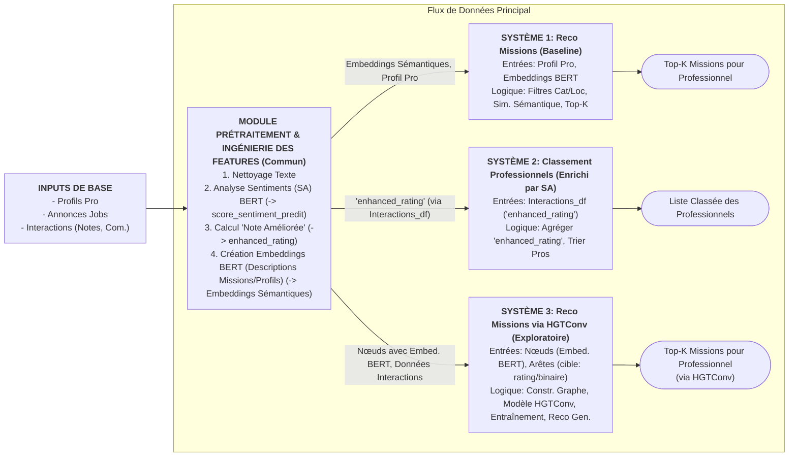

```mermaid
graph LR
    %% Input Node
    A["<strong>INPUTS DE BASE</strong><br/>- Profils Pro<br/>- Annonces Jobs<br/>- Interactions (Notes, Com.)"]

    %% Preprocessing Module
    B["<strong>MODULE PRÉTRAITEMENT & INGÉNIERIE DES FEATURES (Commun)</strong><br/>1. Nettoyage Texte<br/>2. Analyse Sentiments (SA) BERT (-> score_sentiment_predit)<br/>3. Calcul 'Note Améliorée' (-> enhanced_rating)<br/>4. Création Embeddings BERT (Descriptions Missions/Profils) (-> Embeddings Sémantiques)"]

    %% System Nodes
    C["<strong>SYSTÈME 1: Reco Missions (Baseline)</strong><br/>Entrées: Profil Pro, Embeddings BERT<br/>Logique: Filtres Cat/Loc, Sim. Sémantique, Top-K"]
    D["<strong>SYSTÈME 2: Classement Professionnels (Enrichi par SA)</strong><br/>Entrées: Interactions_df ('enhanced_rating')<br/>Logique: Agréger 'enhanced_rating', Trier Pros"]
    E["<strong>SYSTÈME 3: Reco Missions via HGTConv (Exploratoire)</strong><br/>Entrées: Nœuds (Embed. BERT), Arêtes (cible: rating/binaire)<br/>Logique: Constr. Graphe, Modèle HGTConv, Entraînement, Reco Gen."]

    %% Output Nodes
    F(["Top-K Missions pour Professionnel"])
    G(["Liste Classée des Professionnels"])
    H(["Top-K Missions pour Professionnel<br/>(via HGTConv)"])

    %% Connections
    A --> B

    subgraph "Flux de Données Principal"
        direction LR
        B -- "Embeddings Sémantiques, Profil Pro" --> C
        C --> F

        B -- "'enhanced_rating' (via Interactions_df)" --> D
        D --> G

        B -- "Nœuds avec Embed. BERT, Données Interactions" --> E
        E --> H
    end

    %% Styling suggestions (optional, may need to be adapted or use Mermaid init/CSS)
    %% classDef default fill:#333,stroke:#fff,stroke-width:2px,color:#fff;
    %% classDef ioStyle fill:#555,stroke:#fff,stroke-width:2px,color:#fff,rx:5px,ry:5px;
    %% class A,B,C,D,E default;
    %% class F,G,H ioStyle;
```
